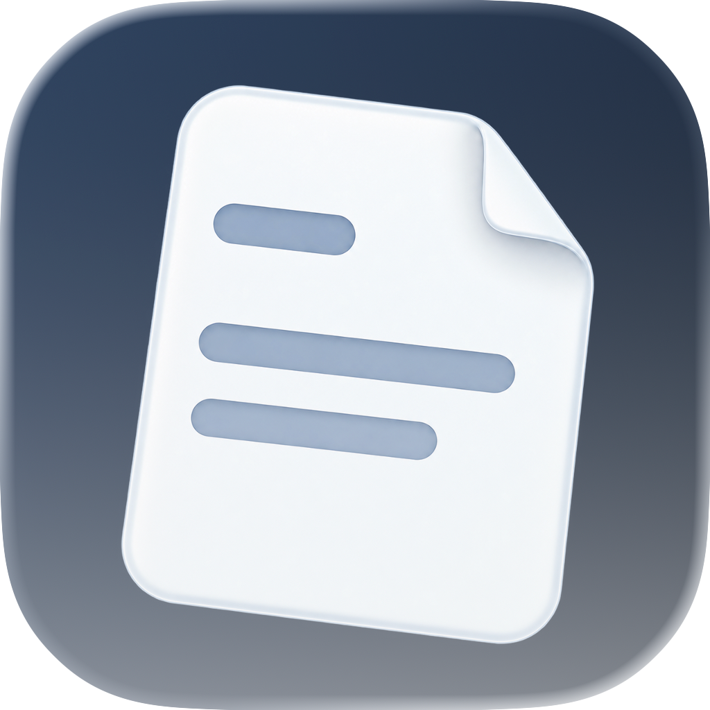
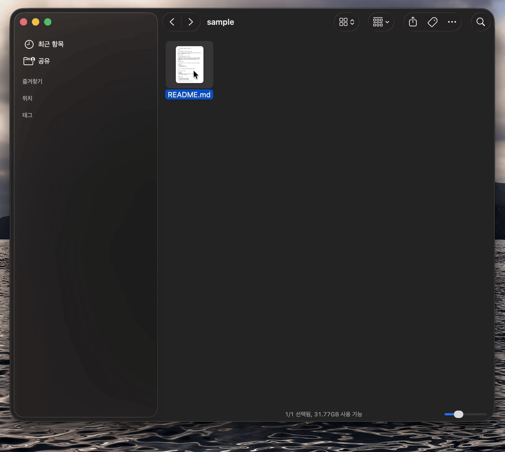

<!-- Created by JDeoks on 9/27/26. -->

# 플로트

[English](README.md) · **한국어**

**Space 한 번으로, 가볍게.**

Finder에서 Markdown과 코드를 읽기 좋게 보여줘요.
README의 표와 다이어그램을 읽고, 소스 코드를 확인하고, 필요한 내용을 선택해 복사하세요.

**[macOS용 다운로드](https://github.com/JDeoks/PHLOAT/releases/download/v0.1.0/PHLOAT-0.1.0.dmg)**

## 설치

1. 다운로드한 DMG를 열고 **플로트**를 **응용 프로그램** 폴더로 옮겨 주세요.
2. 플로트를 한 번 실행해 주세요. 훑어보기가 적용되지 않으면 **시스템 설정 → 일반 → 로그인 항목 및 확장 프로그램 → 훑어보기**에서 플로트를 켜 주세요. macOS 버전에 따라 위치는 달라요.
3. Finder에서 Markdown 또는 지원하는 코드 파일을 선택하고 **Space**를 눌러 주세요.

AI에게 맡기려면 Mac에서 명령을 실행할 수 있는 AI에게 [설치 스킬](skills/phloat-setup/SKILL.md)을 전달하고 “플로트 설치하고 훑어보기 설정해 줘”라고 요청하세요.

## 무엇을 할 수 있나요?

- **Markdown을 문서처럼** — 제목, 표, 체크리스트와 코드 블록을 읽기 좋게 보여줘요. Mermaid 다이어그램과 수식도 지원해요.
- **코드를 선명하게** — 구문 강조, 줄 번호, 자동 줄바꿈으로 코드를 편하게 확인해요.
- **원문 확인과 복사** — Markdown의 렌더링 화면과 원문을 오가고, 필요한 텍스트나 코드 블록을 복사해요.
- **내 취향에 맞는 테마** — 기본 테마를 고르거나 직접 색상을 조정해요. 라이트·다크 모드를 지원해요.

## 지원 파일

| 종류 | 지원 형식 |
| --- | --- |
| Markdown | Markdown 문서 |
| HTML | `.html`, `.htm` |
| Swift | `.swift` |
| JavaScript · JSX | `.js`, `.jsx` |
| TSX | `.tsx` |
| Python | `.py` |

오픈소스 라이선스: [고지 목록](ThirdPartyNotices.md).
